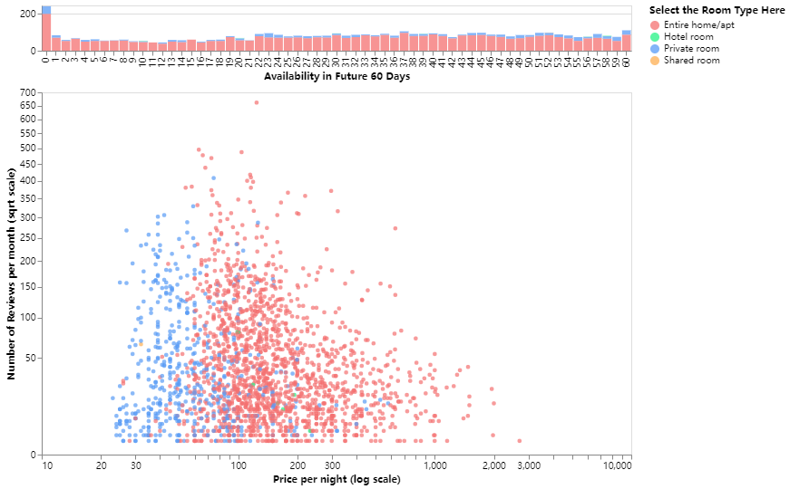
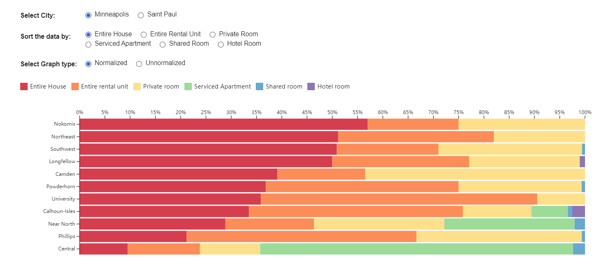
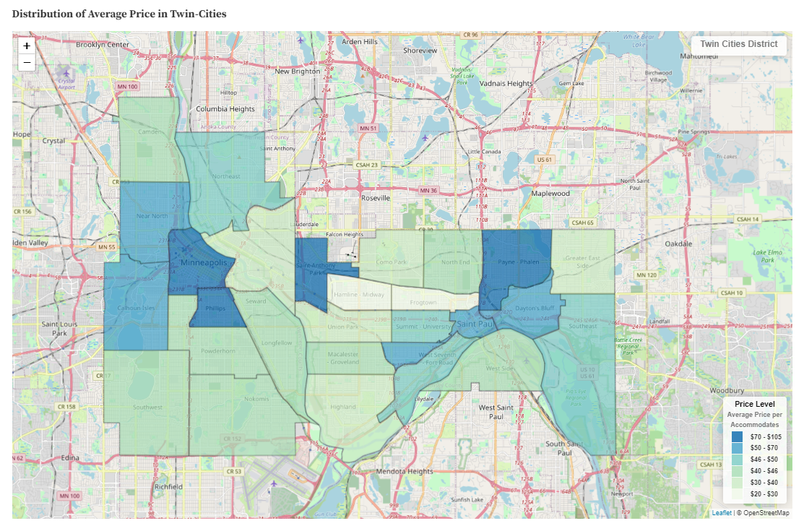

# Interactive Graph of Twin-Cities Airbnb Dataset

### Author: Rita Li, Kaiyang Yao, Yutong Wu

This is an interactive graphic that enables users to select preferred Airbnb house based on price, ratings, room types, availability and popularity.

You can view the project by open the ipynb file in this folder or get access to it through the link : [Link to the notebook](https://colab.research.google.com/drive/1AwV7va7z0txBCxKBiW4Z499G_bhA3rq0?usp=sharing)

# Twin Cities Airbnb Data Analysis: How to choose a suitable house?

### Author: Yutong Wu, Rita Li, Kaiyang Yao

This is an data analyzing report of the Airbnb dataset in Twin Cities including selectable bar chart and interactive maps.

The project is accessible through this link: [Link to the notebook](https://observablehq.com/@yutongwu/twin-cities-airbnb-data-analysis-how-to-choose-a-suitable-ho)

