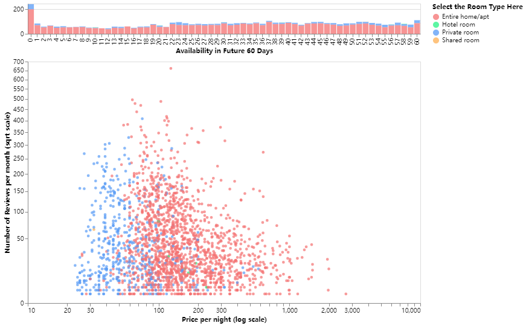

# Interactive Graph of Twin-Cities Airbnb Dataset

## Author: Rita Li, Kaiyang Yao, Yutong Wu

This is an interactive graphic that enables users to select preferred Airbnb house based on price, ratings, room types, availability and popularity.

You can view the project by open the ipynb file in this folder or get access to it through the link : [Link to the notebook](https://colab.research.google.com/drive/1AwV7va7z0txBCxKBiW4Z499G_bhA3rq0?usp=sharing)

