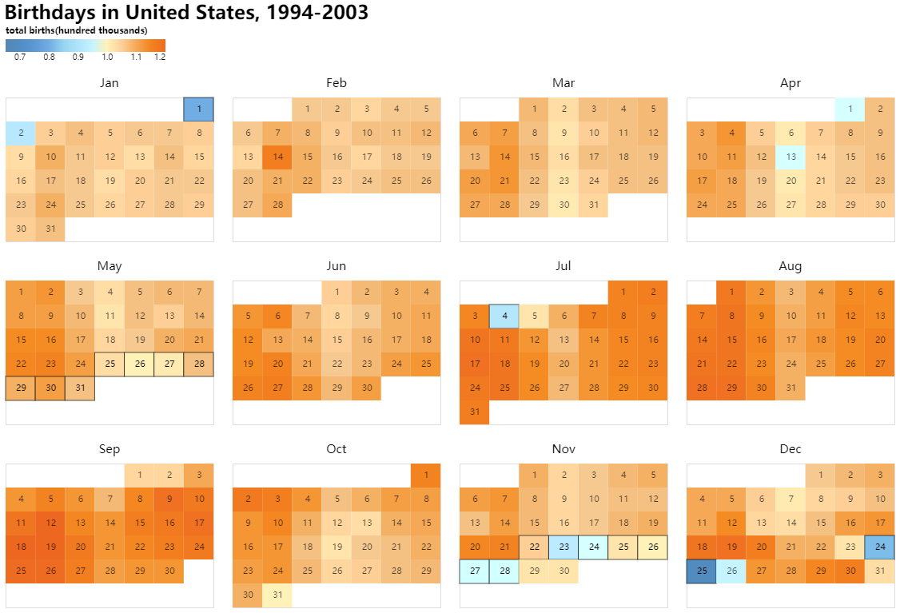

# Homework 1:  Data Visualization: Less Birth on Holidays?

This chart is a heat map that summarizes the total number of births on each date since 1994-2003. The chart was made to answer a question: Is it true that fewer babies are born on federal holidays and anniversaries(including New Year’s Day, Memorial Day, Independence Day, Thanksgiving Day, and Christmas) and the day after holidays?

According to the chart, the color of the square that represents the total births on federal holidays is colder than the color of the other squares that are close to them. Therefore, it can be said that there are relatively few births on holidays and the day after the holidays.

## Data Transformation

Based on the original data, nominal data that representing a holiday is added while dates that are not holidays are marked as 0. In order to make the numbers easier to read and compared, the number of total births is divided by 100000. The original value range is changed from 60000 to 120000 from 0.6 to 1.2 correspondingly.

## Data Encoding
When choosing the type of data visualization, I compared the two types of bar char and heat map. The bar chart is more direct in expressing data differences because it is easier for the human eye to accurately judge the difference in length than colors. However, because 365 days is relatively large data, it will be too long if all dates are arranged on one axis which is Toinconvenient for readers to locate each date. So I chose a heat map.

Different from the normal heatmap, I chose to arrange the grids representing the date in a calendar manner because this is more suitable with people's usual habit of reading calendars. Each grid is colored according to the number of people born on that day: orange represents that relatively more people were born on that date, and blue represents the opposite. Because human eyes are not good at comparing color gaps, so the number that represents the total number of births in each date can be viewed when readers put their cursor on it.

To show the focus of this chart more clearly, all dates that are holidays(including New Year’s Day, Memorial Day, Independence Day, Thanksgiving Day, and Christmas) are marked by a solid black frame, and the numbers on those grids also have a higher opacity to make them easier to see.

## Limitations
Because the total number of births is different at different times of the year, it will be relatively more from July to September, and relatively less from January to March. Putting the number of births on all dates on the same scale will make the entire value range too wide, and it does not well show the influence of holidays on the number of births. If we can calculate the ratio of the number of births on this date to the average number of births this week based on the total number of births in the week before and after each date, it should be more proving.
