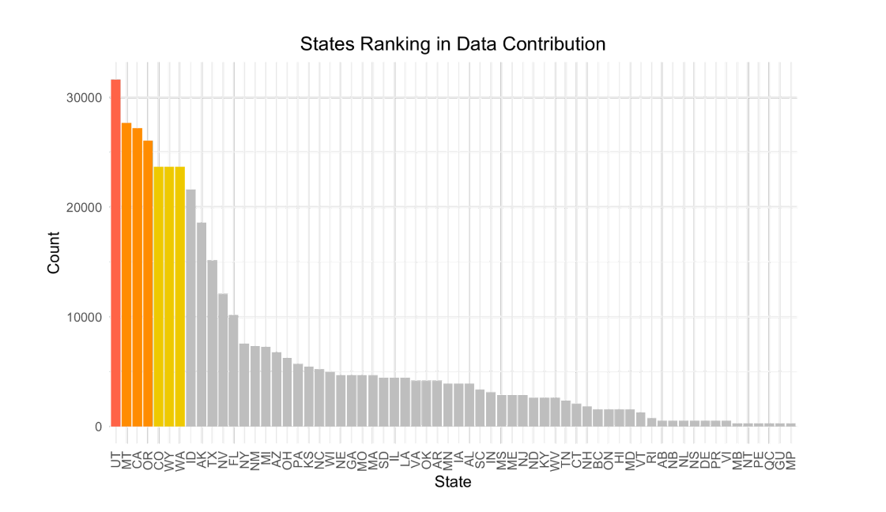
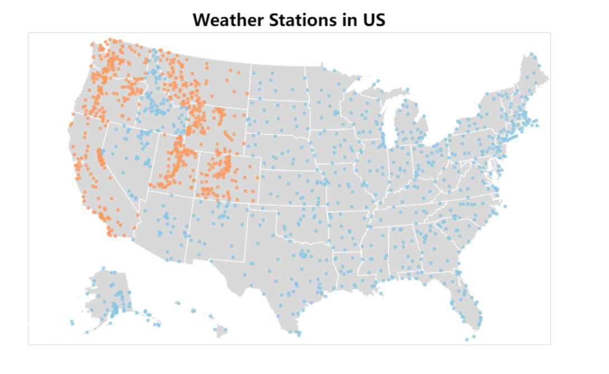
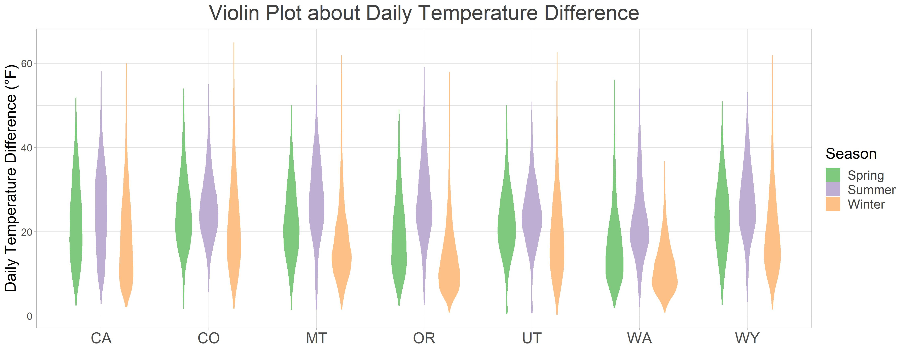
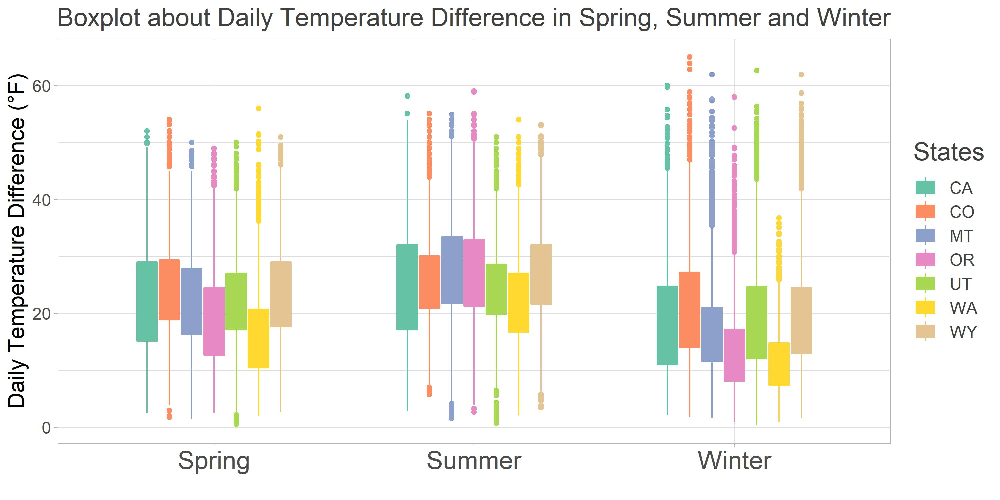
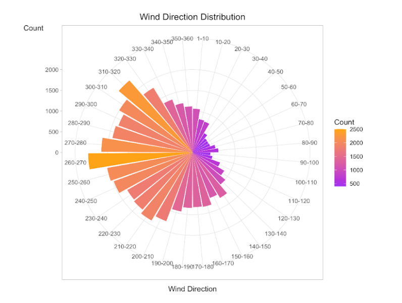
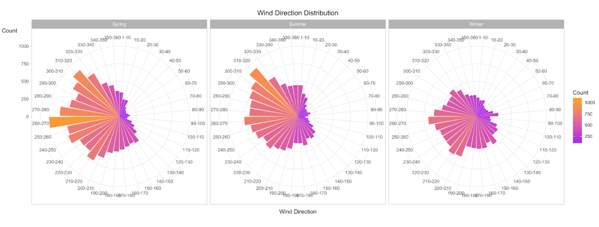
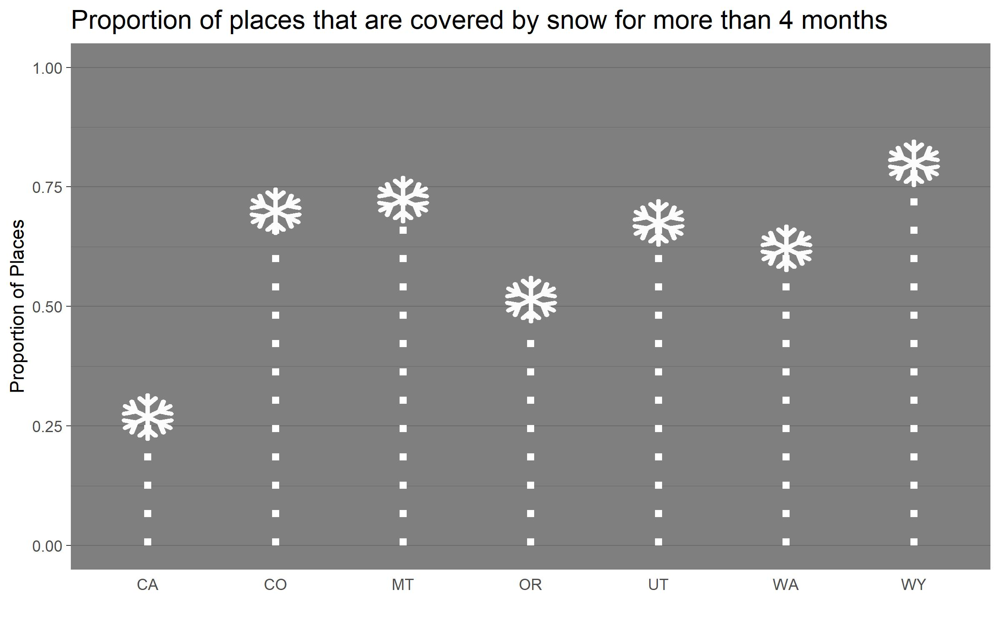
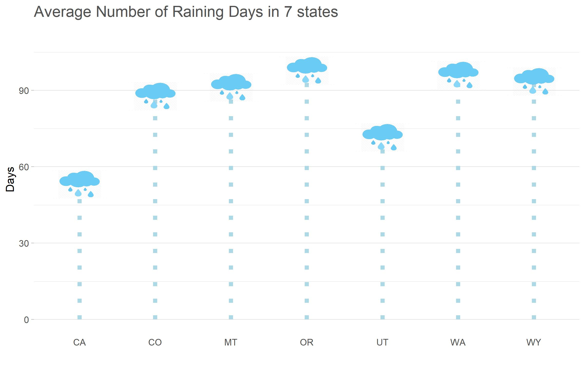

# Daily Weather Dataset Report
## Author: Rita Li & Kaiyang Yao

## Introduction
For this visualization assignment, we choose a daily weather dataset, which contains daily U.S. weather measurements in 2017. Each row of the dataset shows a series of weather indexes on a specific date, measured by a specific weather station. The weather measurements include the maximum and minimum temperature during the day, the precipitation, snowfall, snow depth, and the wind speed and direction on that day. 

When we study this dataset, there are several points worth noting: 

1. This dataset contains more than 410,000 data, which is too much for any data visualization software. In the end, we decided to shrink the database and only study the top seven states in terms of the number of weather stations. The number of data after reduction is about 180,000.

2. This data is about the weather in the United States in 2017, but it contains many weather stations that are not in the United States (many of which are in Canada). In addition, the date of the data is not from January 1st to December 31st. In fact, all the data from September 22 on are missing. This has led to an impact on one of the questions we originally wanted to study, that is, how rain and snowfall in various regions of the United States. After all, in many areas, snowfall is concentrated in winter.
3. There are many NA values in the data related to snowfall and rainfall. In order to avoid the impact of this NA value when collating the data, we replaced the NA values in these rows with 0.

## Question 1 - Which state contributes the most to the dataset?

Since there are 500 thousand rows in the original dataset and some states only contribute a small portion of the data, we decide to filter the data by state and pay attention only to the top several states with the highest number of data contributions. So our first question is: which state contributes the most to the dataset? To approach this question, we use a bar chart to record how many rows each state contributes. Then we rank them in descending order. The answer shows that Utah contributes the most, with more than 30 thousand rows; Massachusetts, California, and Oregon are in the second tier; The third tier includes Colorado, Wyoming, and Washington. All of the top 7 states are in the west! Since a higher volume of data will be more accurate when doing further analysis, we decide to filter all of the other states out and keep only the two 7 states. After filtering, we have 200 thousand rows left. To further explore this question, we plot all of the weather stations in the dataset on a US map. The result is not surprising: the 7 states have a relative denser distribution of weather stations. For all the analysis below, we will zero in on the data of those 7 states. 

## Question 2 - Does season have an impact on daily temperature difference?

Our first approach to this question is to use the date of each weather record item in the original database to calculate the season it is in according to the international standard seasonal division. Because the source database is missing data in part of dates, only three seasons, spring, summer, and winter, are included in the following analysis process. At the same time, we subtract TMIN (the lowest daily temperature) from TMAX (the highest daily temperature) in the source database to get a new quantitative variable named "tempchange" that represents the daily temperature difference. We first draw a violin graph to visualize the distribution of daily temperature change for different states. Within each state, we color the violin graph based on the season. This method allows us to compare the difference in the distribution of daily temperature difference between spring, summer, and winter in each state.

As shown on the graph, the daily temperature changes in winter have a higher density at 10 degrees Fahrenheit, which is relatively lower than the temperature change with the highest density in summer and spring. Moreover, it is clear that the mode of temperature difference in summer is slightly higher than that in spring in the MT, OR, WA, while in other states, the distribution of daily temperature difference in spring and summer is very similar.

The advantage of the Violin Plot is that it can show subtle differences that are not detectable in the box plot. On the other hand, the box plot shows the outliers in the data more clearly. Therefore, we also drew a boxplot to illustrate the influence of season on the daily temperature difference. In this boxplot, we divide the data into three groups according to the season. Within each group, color the boxplot according to the state. As can be seen from the graph, the boxplots of the winter group have lower median values and higher and more outliers.

## Questions 3: Which direction contains the fastest wind speed?

Next, we change our attention to the wind speed. There are 3 attributes about wind speed in the dataset. AWND stands for average daily wind speed; WDF5 and WSF5 stand for the direction of the fastest 5-second wind and its speed respectively. We are interested in finding if there is a pattern of the direction of the fastest 5-second wind speed. That is, if the fastest 5-second wind speed blows to a specific direction more often. 

The graph above shows us a clear pattern. Most of the wind in the 7 states we choose are blowing from east to west, with only a few blowing to the east direction. To further explore the pattern, we seperate the count by season and check if there is a seasonal pattern of wind direction.

From the graph, some interesting patterns are shown. Wind direction distribution is uneven in Spring and Summer, with the majority being east wind. But the distribution is much even in Winter. 

## Some Interesting Finding
When we studied the snow data, we found a phenomenon. There are some dates that SNOW (snowfall) of that day is zero, but SNWD (depth of snow) is not zero. This also aroused our curiosity: What is the condition of snow accumulation in the seven states we studied? Therefore, based on the original database, we calculated the number of weather stations in each state with more than four months of snow cover (120 days) and obtained the proportion of areas with more than 120 days of snow. We drew a lollipop plot to show our findings, replacing the circle with the image of snowflakes.

We also drew a lollipop plot about the rainy days in these 7 states. The height of each cloud represents the averager number of rainy days of all weather stations in each state. Though this graph can not perfectly show all the data about the rainy weather in 7 states, it is still a very interesting plot.

